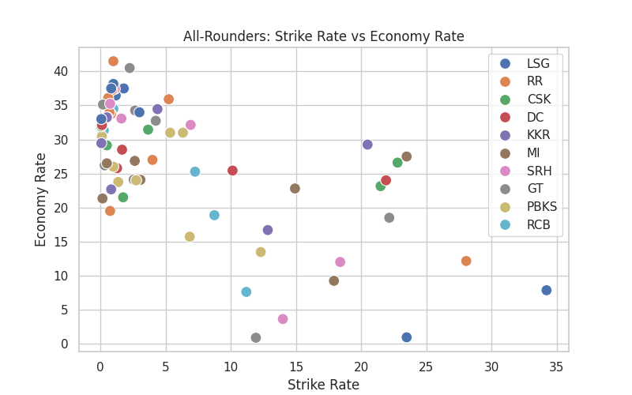
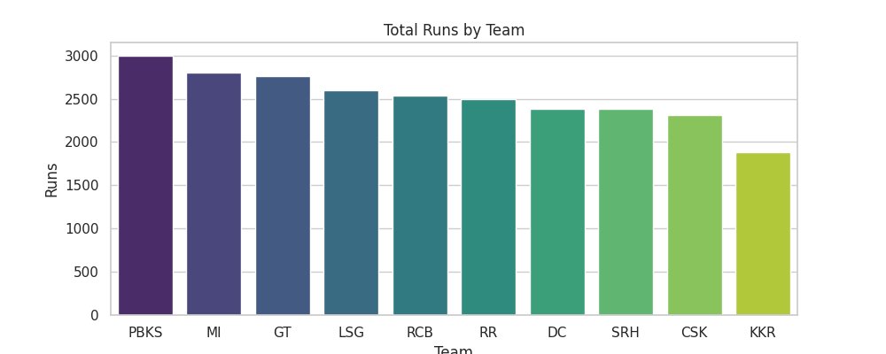
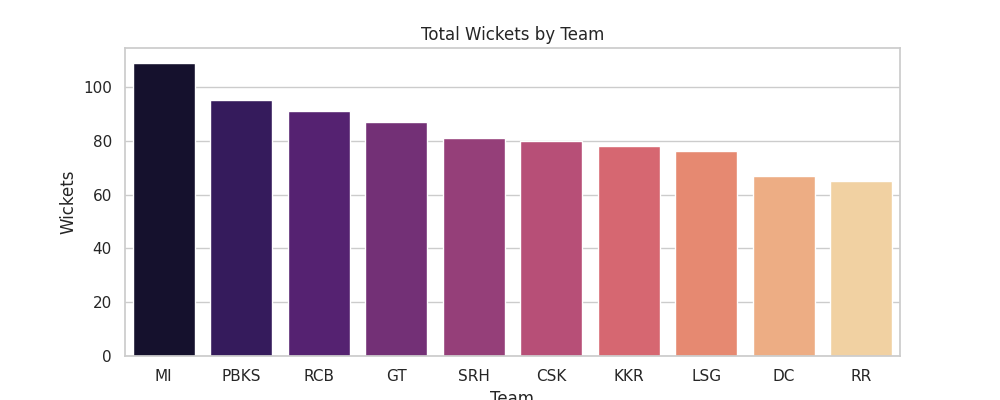
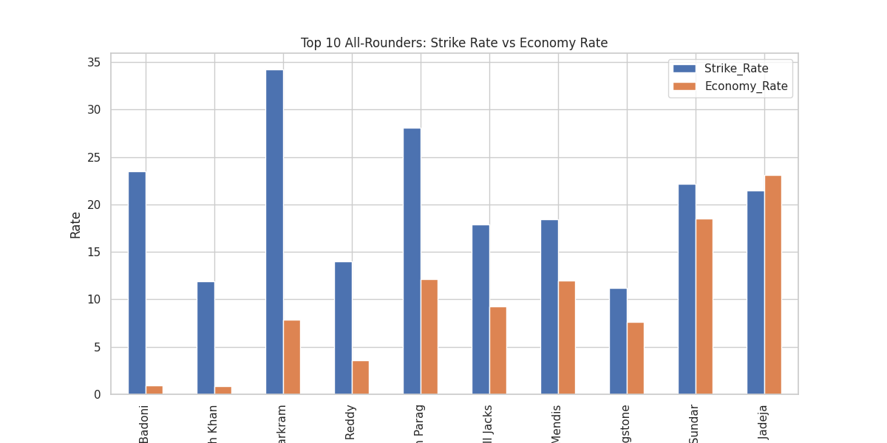
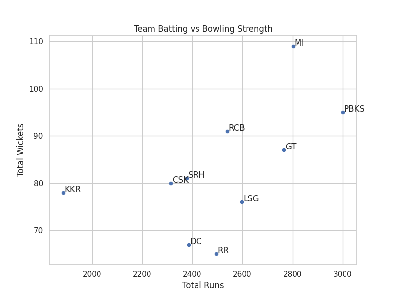
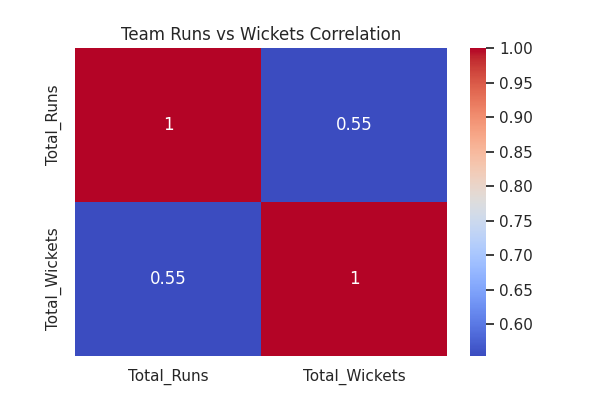

# IPL 2025 – Exploratory Data Analysis (EDA)

## 📌 Overview
This project presents an **Exploratory Data Analysis (EDA)** of the IPL 2025 season, focusing on both individual and team-level performance using batting and bowling statistics.  

The analysis emphasizes **fair comparisons, weighted metrics, and clear visualizations** to derive meaningful insights while regaining hands-on coding practice.

---

## 🎯 Objectives
- Analyze individual batting and bowling performances in IPL 2025  
- Compare top performers against season-wide averages  
- Evaluate team-level batting and bowling efficiency using weighted metrics  
- Study the balance between batting and bowling efficiency across teams  

---

## ❓ Questions Explored

1. For players who appear in both batting and bowling datasets (**all-rounders**), how does their **batting strike rate** compare with their **bowling economy rate**?  
   **Visualization:**  
   

2. Which team has the **highest total runs** by its batters?  
   **Visualization:**  
   

3. Which team has the **highest total wickets** through its bowlers?  
   **Visualization:**  
   

4. Who are the **Top 10 all-rounders** based on batting strike rate and bowling economy?  
   **Visualization:**  
   

5. Is there a **correlation between total team runs and total team wickets**?  
   **Visualizations:**  
     
   

---

## 📂 Dataset
- **Source:** Kaggle (IPL 2025 dataset)  
- Includes player-level batting and bowling statistics for IPL 2025  
- Dataset is **not uploaded** to this repository due to licensing; refer to Kaggle for access  

---

## 🛠 Methodology
- Cleaned data and converted types for consistency  
- Applied **minimum threshold criteria** to avoid small-sample bias  
  - Batting analysis: minimum balls faced  
  - Bowling analysis: minimum overs bowled  
- Computed **team-level efficiency metrics**:  
  - Weighted Strike Rate for batting  
  - Weighted Economy Rate for bowling  
- Used **visualizations** (Matplotlib & Seaborn) for insights  

---

## 📈 Key Insights
- Top all-rounders balance **high strike rate** with **low economy**, highlighting their impact  
- Teams with stronger batting do not always have equally strong bowling  
- Moderate correlation exists between **team runs** and **team wickets**  
- Combined efficiency analysis highlights distinct **team strengths and weaknesses**  

---

## 🛠 Tools & Technologies
- Python  
- Pandas  
- NumPy  
- Matplotlib  
- Seaborn  
- Google Colab  

---

## ✅ Conclusion
This project reinforced the importance of:  
- Defining **fair metrics**  
- Avoiding **misleading averages**  
- Structuring a full **EDA workflow** on a real-world dataset  

---

## 🔮 Future Scope
- Extend analysis to **match-level or phase-wise performance**  
- Compare IPL 2025 trends with **previous seasons**  
- Create **interactive dashboards** for visual storytelling  

---

## 👤 Author
**Shaik Anas**  
Aspiring Data Analyst | Python | Data Visualization | EDA  

**GitHub Repository:** [https://github.com/Anassk-ds/IPL-2025-EDA](https://github.com/Anassk-ds/IPL-2025-EDA)
