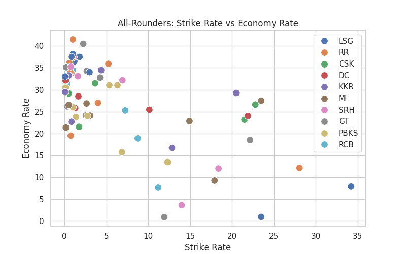
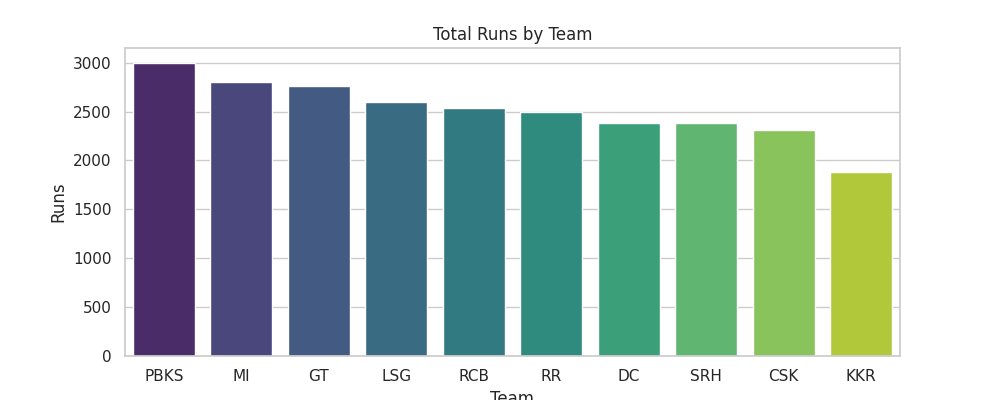
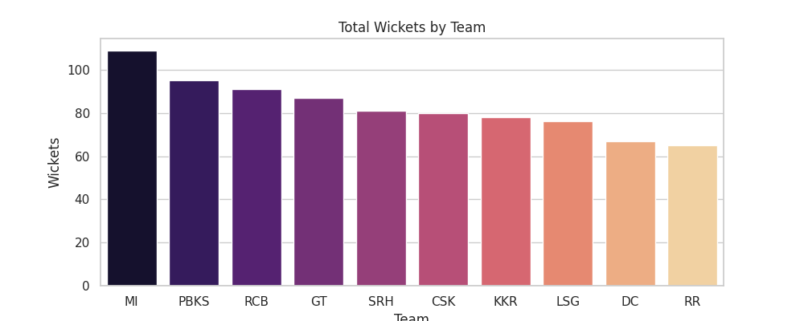
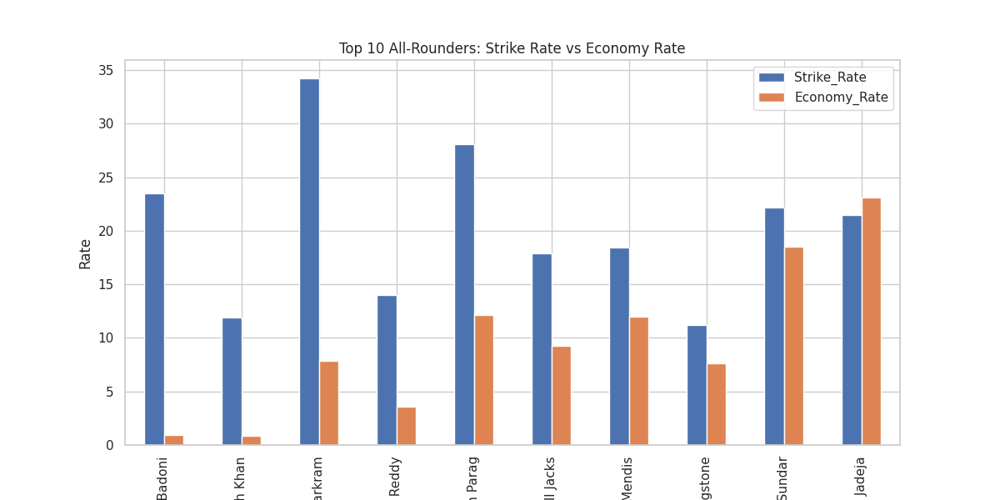
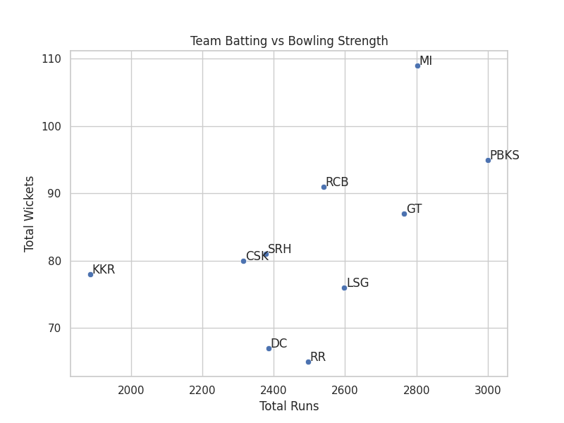
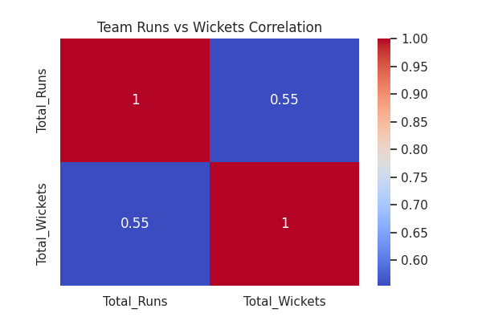

# IPL 2025 Exploratory Data Analysis (EDA)

**Author:** [Shaik Anas](https://github.com/Anassk-ds)  
**Focus:** Data Science · Data Analytics · Sports Analytics  
**Notebook:** [`IPL_2025_EDA.ipynb`](./IPL_2025_EDA.ipynb)

This project explores IPL 2025 player-level batting and bowling statistics using Python. It focuses on player performance, all-rounder comparisons, team batting and bowling metrics, and the relationship between team runs and wickets.

- **Repository:** https://github.com/Anassk-ds/IPL-2025-EDA
- **Portfolio:** https://anassk-ds.github.io/Portfolio-Website/
- **LinkedIn:** https://www.linkedin.com/in/shaik-anas-b03a962a8/

## Project overview

Exploratory Data Analysis (EDA) helps turn raw tables into questions that can be investigated with data. In this project, batting and bowling statistics are examined separately and then combined where appropriate to compare player and team performance.

The notebook uses data cleaning, qualification thresholds, dataset merging, weighted metrics, charts, and correlation analysis. The goal is to make comparisons more informative and to consider how metric selection and sample size affect interpretation.

## Questions explored

1. **All-rounder comparison:** Among players present in both datasets, how do batting strike rate and bowling economy rate compare?
2. **Team batting:** Which team has the highest combined runs in the batting data?
3. **Team bowling:** Which team has the highest combined wickets in the bowling data?
4. **Top all-rounders:** How do strike rate and economy rate compare for the selected top 10 all-rounders?
5. **Team-level relationship:** What relationship, if any, appears between total team runs and total team wickets?

The questions above describe the scope of the notebook. Consult the executed notebook and its charts for the actual values and conclusions.

## Dataset

The project uses IPL 2025 player-level batting and bowling statistics sourced from Kaggle. The original CSV files are not stored in this repository; download the dataset separately and check its source page for applicable terms and attribution requirements.

Required files:

- `IPL2025Batters.csv`
- `IPL2025Bowlers.csv`

Place both files in the project root directory, alongside `IPL_2025_EDA.ipynb`. The filenames should match the names used in the notebook.

## Tools and technologies

- **Python** — analysis workflow
- **Pandas** — data loading, cleaning, transformation, and aggregation
- **NumPy** — numerical operations
- **Matplotlib** — charts
- **Seaborn** — statistical visualizations
- **Jupyter Notebook / Google Colab** — interactive analysis

## Methodology

### 1. Inspect and prepare the data
Review the batting and bowling tables, check missing values, and convert data types where required.

### 2. Apply qualification thresholds
Use minimum balls-faced and overs-bowled thresholds when comparing players. These filters help reduce the risk of drawing conclusions from very small samples. The exact thresholds should be checked in the notebook.

### 3. Identify all-rounders
Merge the batting and bowling datasets to identify players represented in both tables, then compare their batting strike rates and bowling economy rates.

### 4. Aggregate team statistics
Summarize runs and wickets at team level and calculate weighted batting and bowling metrics where appropriate. Review the notebook's formulas and column definitions when interpreting these metrics.

### 5. Visualize and interpret
Use bar charts, scatter plots, and a correlation heatmap to inspect differences and relationships. Correlation describes association in the analyzed data; it does not by itself establish causation.

## Visualizations

The notebook is set up to generate these output files:

| Visualization | Output file |
|---|---|
| All-rounder performance | `all_rounders_plot.png` |
| Team runs | `team_runs_plot.png` |
| Team wickets | `team_wickets_plot.png` |
| Top 10 all-rounders | `top10_allrounders_plot.png` |
| Team runs vs. wickets | `team_correlation_plot.png` |
| Correlation heatmap | `team_correlation_heatmap.png` |

If the image files have been generated and committed to the repository, you can preview them below. If they are not yet present in the repository, run the notebook and commit the generated files first.

<!-- Uncomment each image line only after confirming the corresponding PNG is committed in the repository. -->
<!--  -->
<!--  -->
<!--  -->
<!--  -->
<!--  -->
<!--  -->

## Run the project

### Option A: Run locally

1. Install Python and Git if they are not already installed.
2. Clone the repository:

   ```bash
   git clone https://github.com/Anassk-ds/IPL-2025-EDA.git
   cd IPL-2025-EDA
   ```

3. Create and activate a virtual environment (optional, but recommended):

   **Windows**
   ```bash
   python -m venv .venv
   .venv\Scripts\activate
   ```

   **macOS / Linux**
   ```bash
   python3 -m venv .venv
   source .venv/bin/activate
   ```

4. Install the required libraries:

   ```bash
   python -m pip install pandas numpy matplotlib seaborn jupyter
   ```

5. Download the dataset from its Kaggle source and place `IPL2025Batters.csv` and `IPL2025Bowlers.csv` in the repository root.
6. Launch Jupyter:

   ```bash
   jupyter notebook
   ```

7. Open `IPL_2025_EDA.ipynb` and run the cells in order.

### Option B: Use Google Colab

1. Open the notebook file from the repository.
2. Upload the two CSV files to the Colab session, or mount storage containing them.
3. Confirm the notebook's file paths match where you placed the CSV files.
4. Run the cells from top to bottom.

> **Reproducibility note:** Notebook paths, dataset column names, and qualification thresholds must match the actual files. If your local dataset uses different column names or filenames, update the notebook accordingly.

## Interpretation notes

- Strike rate and economy rate measure different aspects of performance; compare them in context rather than treating them as interchangeable.
- Qualification thresholds can change which players appear in comparisons.
- Weighted metrics depend on their exact formula and denominator. Refer to the notebook before interpreting a weighted value.
- Team runs and team wickets summarize different outcomes; a correlation between them does not mean one causes the other.
- Dataset coverage and column definitions affect the conclusions. Mention these limitations when presenting findings.

## Future improvements

Possible extensions include:

- Compare IPL 2025 with earlier seasons.
- Add match-level or innings-phase analysis.
- Explore powerplay, middle-over, and death-over performance if the required data is available.
- Add an interactive dashboard.
- Document exact metric formulas and qualification thresholds in the notebook and README.

## About the author

**Shaik Anas** is a B.Tech CSE (Data Science) student at Chalapathi Institute of Technology, interested in data analysis, Python, machine learning, and software development.

- GitHub: https://github.com/Anassk-ds
- LinkedIn: https://www.linkedin.com/in/shaik-anas-b03a962a8/
- Portfolio: https://anassk-ds.github.io/Portfolio-Website/
- LeetCode: https://leetcode.com/u/anas_shaik

## Feedback

If you find an issue with the analysis or have a suggestion for an extension, open a GitHub issue or connect through one of the profiles above.

---

*This project is an educational data-analysis exercise. Refer to the source dataset and the notebook for the data and calculations used.*
